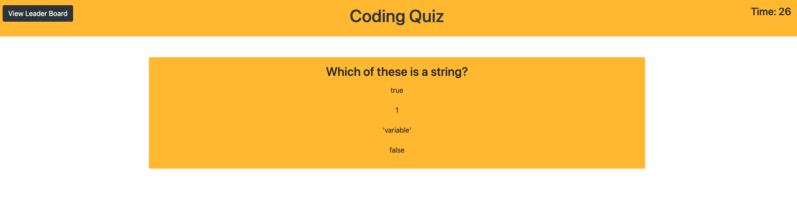
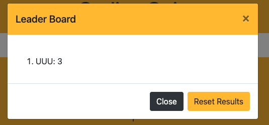

# Code-Quiz

This week's assignment was to create a functioning quiz. The quiz is to include a timer and a score that saves locally.

## Installation

1) Create a starting page letting the user know about the quiz and to press the start button to begin the quiz.

2) The user will then answer a series of questions while a timer counts down. For every incorrect answer, the timer will lose ten seconds. A running total of their score will be presented as well.

3) Once the user completes all of the questions or the timer reaches zero, they will be shown their score and asked to input their initials, which will save to the high score list. They can choose to clear scores as well.

## Screenshots

## License

MIT License

Copyright (c) [year] [fullname]

Permission is hereby granted, free of charge, to any person obtaining a copy
of this software and associated documentation files (the "Software"), to deal
in the Software without restriction, including without limitation the rights
to use, copy, modify, merge, publish, distribute, sublicense, and/or sell
copies of the Software, and to permit persons to whom the Software is
furnished to do so, subject to the following conditions:

The above copyright notice and this permission notice shall be included in all
copies or substantial portions of the Software.

THE SOFTWARE IS PROVIDED "AS IS", WITHOUT WARRANTY OF ANY KIND, EXPRESS OR
IMPLIED, INCLUDING BUT NOT LIMITED TO THE WARRANTIES OF MERCHANTABILITY,
FITNESS FOR A PARTICULAR PURPOSE AND NONINFRINGEMENT. IN NO EVENT SHALL THE
AUTHORS OR COPYRIGHT HOLDERS BE LIABLE FOR ANY CLAIM, DAMAGES OR OTHER
LIABILITY, WHETHER IN AN ACTION OF CONTRACT, TORT OR OTHERWISE, ARISING FROM,
OUT OF OR IN CONNECTION WITH THE SOFTWARE OR THE USE OR OTHER DEALINGS IN THE
SOFTWARE.

## Questions

For any questions, please contact me at:

**Email:** calebhopkins@outlook.com

**GitHub Profile:** [CalebTheCreative]("https://github.com/CalebTheCreative")